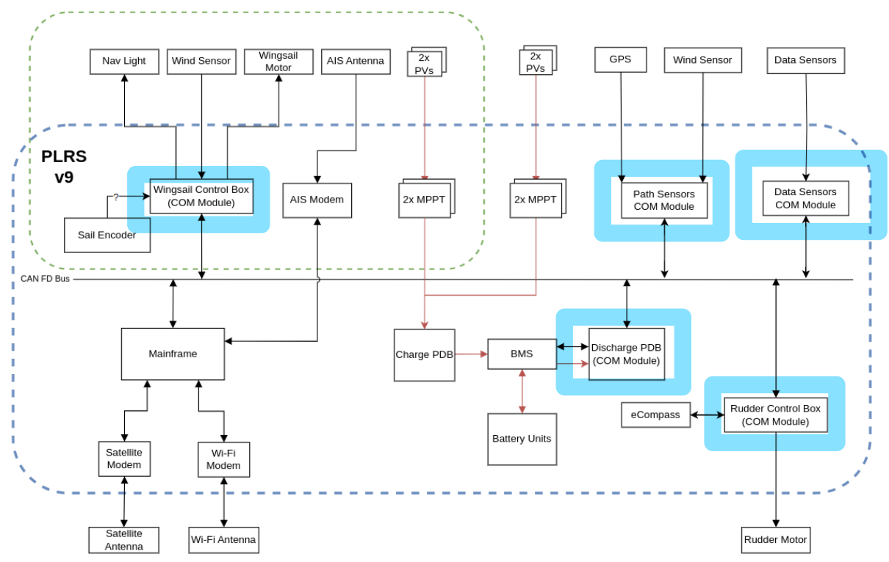
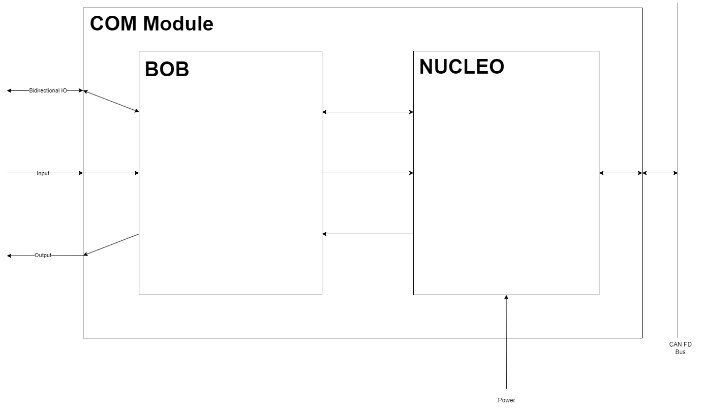
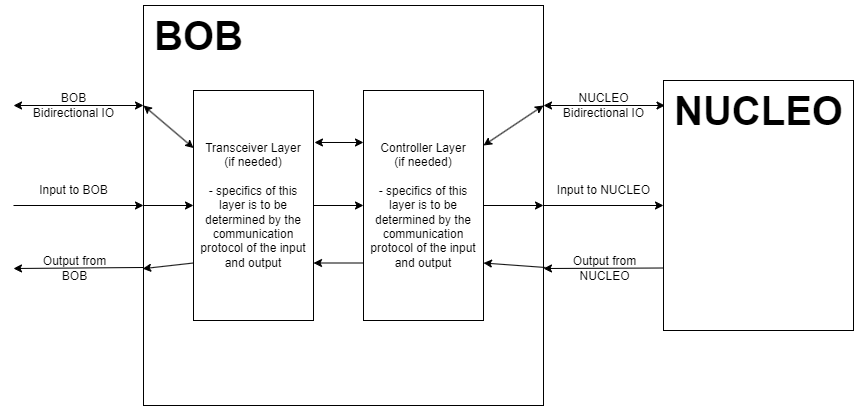

# Communication Module Firmware (COM Module)

The Communication Modules are microcontrollers with the specific purpose of providing bidirectional communication between a device/sensor on the boat and the main computer. It processes these messages and provides low-level interfacing and control of individual hardware devices on the boat. Examples such applications include rudder and wingsail controls, and data aquisition from various sensors on the boat.

This repository consists of multiple firmware projects from the electrical team working on the project Polaris at UBC Sailbot. All of the firmware is written for the [STM32U5 Nucleo-144](https://www.st.com/en/evaluation-tools/nucleo-u575zi-q.html) boards.

Current projects include:

1. Base communication module library
2. Rudder controller firmware
3. Wingsail controller firmware



## COM Module High-level Design

The COM Module is split into two parts: The Nucleo board and the breakout board (BOB). Each hardware device on the boat has it's own custom BOB designed specifically for it's needs, while the Nucleo board hardware is the same in all COM Modules.

<!--  -->



## Firmware Design Diagram


### What is the Base Library?
The base library is made up of files corresponding to the boxes in the image above. Namely, they are CAN, Board, Debug, Error, and Config. The purpose of this code is to provide the "outline" for teams to build off of. It contains functions that facilitate communication through CAN, I2C, ADC, PWM, and UART, as well as provides debug and error handling capabilities. Lastly, the configuration file provides unique customizability, and avoids including unneeded code in other teams designs, thereby optimizing performance.

## User Manual
Before continuing, please read the "What is the Base Library" paragraph above if you haven't already.

The three boxes at the top of the firmware design diagram illustrate the tasks of the individual teams. To reach the desired functionality for a specific COM module, such as reading data from a sensor, teams have to determine which functions are required, and what the proper inputs to those functions would be. Most important for this would be the ```Board.h``` file.

There are also features that you can request from the firmware team. If there is any specific functionality you would like for handling errors, such as turning off a sensor if we can no longer receive data from it, then leave your request on the [Confluence feature request page](https://ubcsailbot.atlassian.net/wiki/spaces/prjt22/pages/1994457093/Feature+Request). Additionally, any other requests for code that needs new functions/functionality that isn't included in the base library can also be left in the same place. 

You can find tutorials on using STM32CubeIDE, GitHub, and more in the tutorials folder.

## Repository Structure

```
root/
    README.md
    .gitignore
    LICENSE
    tutorial/                              - Setup instructions and tutorials
    shared docs/                           - Common/shared documents between projects
    setup_instructions.md
    scripts/                               - Automated testing and deployment scripts
    projects/
        project1/
            project/                          - Main CubeIDE Project
            tests/                            - Component level unit tests
                COMPONENT1/
                COMPONENT2/
            docs/                             - Project technical documentation
                architecture.md
                testing_instructions.md
                datasheets/
                    component1.pdf
        project2/
```

## Prerequisites

List of tools required to get started:

- [STM32CubeIDE](https://www.st.com/en/development-tools/stm32cubeide.html) - Used to generate initial code and peripherial configurations using the in-built STM32CubeMX.
- [Visual Studio Code](https://code.visualstudio.com/) - Alternative IDE for editing code (rather than CubeIDE).
- [Putty](https://putty.org/) - Used for serial communication between host and STM32U5 board.
- [Git](https://git-scm.com/downloads) - For version control.

If you have not setup your working environment yet, follow the [setup instructions](tutorials/setup.md).
For information on working with GitHub, consult the [github instructions](tutorials/github.md).

## Resources
