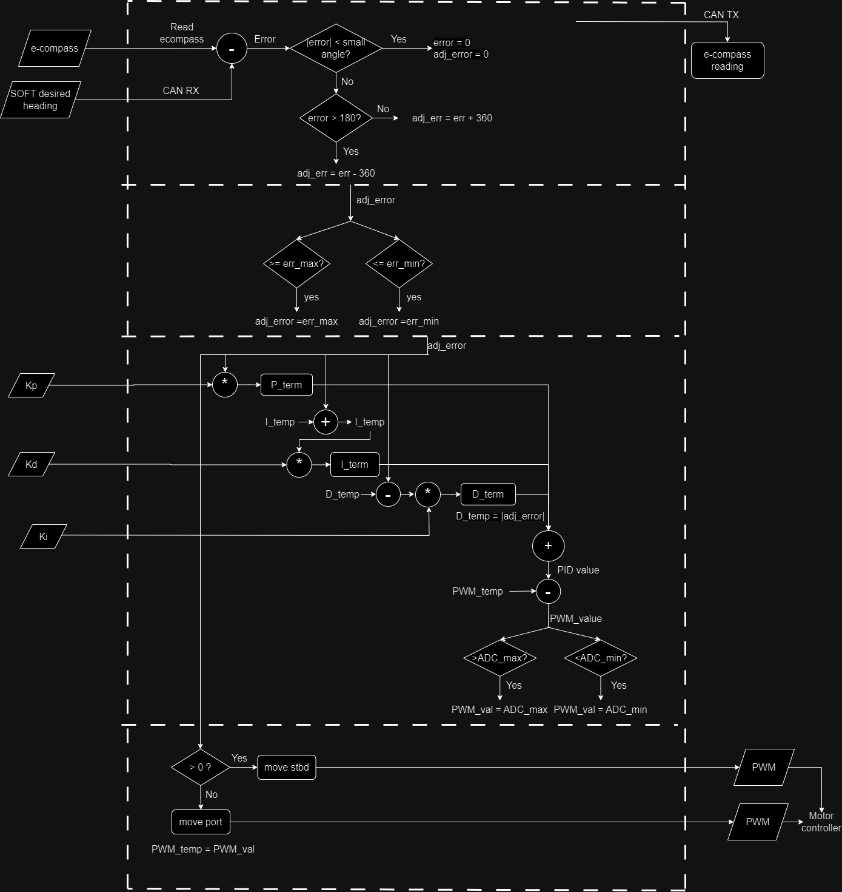

# Rudder Controller

<!--Brief description of project. What is the overall goal?

Repo for everything on the software side of DRV-rudder. System models, MATLAB tests, and firmware files can be found here.-->

## High-level Design

<!--Add some diagrams describing the hardware and/or software design-->

### Firmware Control Flow (PID)
Rudder's PID control firmware flowchart. It shows the basic structure of the code to be implemented (will be updated over time, as required).

### Hardware Components

<!--Name of device and link the datasheet under 'docs/datasheet/'-->

## Notes

<!--Anything that the reader needs to be cautious about-->

Need to install the following MATLAB addons for the .slx files to work:

- Simulink
- Control System Toolbox
- DSP System Toolbox
- PID controller Simulator
